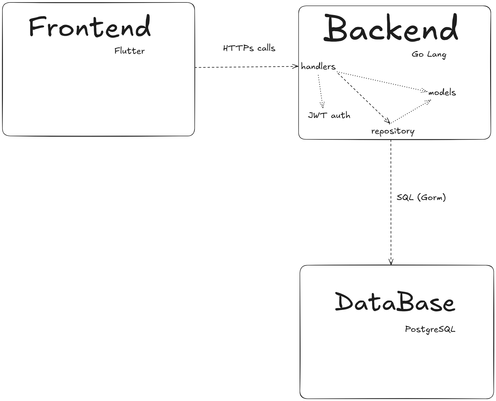
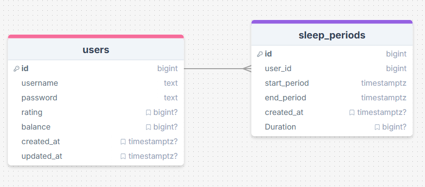

# SleepTrackingApplication
Project for sum-25 Go-Flutter course
## Project overview
We create a web application for track sleep periods of users, with rating system that uses sleep hours as a rating.
## Team
- Ekaterina Zhidkova, team leader, frontend-developer of screens, light/dark themes, and animations
- Anna Morozova, frontend-developer, working with connection of backend and frontend
- Anastasia Varfolomeeva, frontend-developer, is responsible for creating tests for Flutter
- Botalov Egor, backend-developer, working with API, database, JWT-based authentication and authorization
- Vsevolod Nazmudinov, DevOps, backend-developer, working with API, create Swagger documentation
## Setup instructions
1. Dowload the Docker from [official website](official website), and remeber the login and password
2. Clone the repo, run in cmd `git clone https://github.com/SleepTrackingApplication/SleepTrackingApplication`
3. Go to the  `SleepTrackingApplication` - `cd SleepTrackingApplication` `
4. Go to the `backend` directory - `cd backend`
5. Setup the `.env` file
	1. Copy example files:
	```bash
	cp development.env.example development.env
	cp staging.env.example staging.env
	```
	2. Edit the files with your local settings:
	   - Set your database password
	   - Generate a secure JWT key -  for example: `kZs+3FeTR+Db1YGrEtBbpGe3hC7VOqdtD13KJUPUPLI=`
	   - Adjust ports if needed
6. Get the dependencies - `go mod tidy`
7. Run `docker compose up --build -d` for start the Docker
8. Get the dependencies - `flutter get pub`
9. Go to the `frontend` directory - `cd ../frontend`
10. Run `flutter run` 
11. Follow the instructions in the console
12. The opened window is our application!
## Architecture

The project follows a client-server architecture and consists of three main components:

- **Flutter Frontend** – A cross-platform mobile and web application.
- **Go Backend** – A RESTful API providing business logic, authentication, and database interaction.
- **PostgreSQL** – A relational database used to store user and application data.
### Explanation
- The **Flutter** client communicates with the backend via HTTPS using RESTful API calls.
- The **Go backend** handles request routing, input validation, JWT-based authentication, and communicates with the PostgreSQL database.
- **PostgreSQL** stores all application data including users, objects, and their relationships.
- **Swagger (OpenAPI)** is used for generating interactive API documentation.
- All components are containerized and managed using **Docker Compose**.
- A **CI/CD pipeline** is used for automated builds, tests, and deployments.
### Api documentation
#### Swagger 
- You can find the swagger API documentation at `http://localhost:8080/swagger/`  locally after running Docker
#### Postman documentation [Link](https://egorbotalov.postman.co/workspace/Egor-Botalov's-Workspace~6a8f249d-7a80-46c0-87ad-e1706bbe6a9c/collection/46437066-84955ccd-060a-453a-ad82-5cbbd0014221?action=share&creator=46437066)

### Database structure
Below the structure of PostgreSQL database, we use 1:N relationship becasue 1 user can have multiple sleep periods.

## Board with task tracking [Link](https://github.com/orgs/SleepTrackingApplication/projects/1)
## CI/CD pipeline 

### GitHub Actions [Link](https://github.com/SleepTrackingApplication/SleepTrackingApplication/actions)
### Source `.yml` file [Link](.github/workflows/ci-cd.yml)
##  Testing
- You can see rusult of tests in CI/CD pipeline
### How to run tests locally
- Open cmd in directory of project
#### Backend
1. run `cd backend` in cmd 
2. run `go test ./...` in cmd
3. see the result of tesing in cmd
#### Frontend
1. run `cd frontend` in cmd
2. run `flutter test` in cmd
3. see the result of testing in cmd
## Implementation checklist

### Technical requirements (20 points)
#### Backend development (8 points)
- [x] Go-based backend (3 points)
- [x] RESTful API with Swagger documentation (2 points)
- [x] PostgreSQL database with proper schema design (1 point)
- [x] JWT-based authentication and authorization (1 point)
- [x] Comprehensive unit and integration tests (1 point)

#### Frontend development (8 points)
- [ ] Flutter-based cross-platform application (mobile + web) (3 points)
- [x] Responsive UI design with custom widgets (1 point)
- [ ] State management implementation (1 point)
- [ ] Offline data persistence (1 point)
- [x] Unit and widget tests (1 point)
- [x] Support light and dark mode (1 point)

#### DevOps & deployment (4 points)
- [x] Docker compose for all services (1 point)
- [x] CI/CD pipeline implementation (1 point)
- [x] Environment configuration management using config files (1 point)
- [ ] GitHub pages for the project (1 point)

### Non-Technical Requirements (10 points)
#### Project management (4 points)
- [x] GitHub organization with well-maintained repository (1 point)
- [x] Regular commits and meaningful pull requests from all team members (1 point)
- [x] Project board (GitHub Projects) with task tracking (1 point)
- [ ] Team member roles and responsibilities documentation (1 point)

#### Documentation (4 points)
- [x] Project overview and setup instructions (1 point)
- [ ] Screenshots and GIFs of key features (1 point)
- [x] API documentation (1 point)
- [x] Architecture diagrams and explanations (1 point)

#### Code quality (2 points)
- [x] Consistent code style and formatting during CI/CD pipeline (1 point)
- [x] Code review participation and resolution (1 point)

### Bonus Features (up to 10 points)
- [ ] Localization for Russian (RU) and English (ENG) languages (2 points)
- [x] Good UI/UX design (up to 3 points)
- [ ] Integration with external APIs (fitness trackers, health devices) (up to 5 points)
- [ ] Comprehensive error handling and user feedback (up to 2 points)
- [ ] Advanced animations and transitions (up to 3 points)
- [ ] Widget implementation for native mobile elements (up to 2 points)

Total points implemented: XX/30 (excluding bonus points)

Note: For each implemented feature, provide a brief description or link to the relevant implementation below the checklist.
